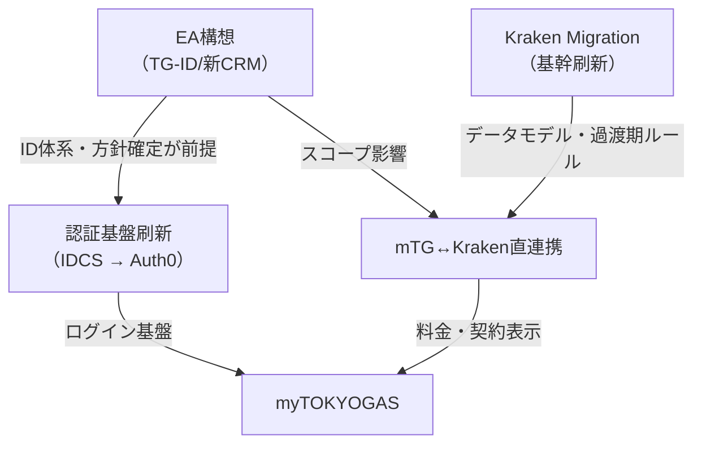

# PJ横断 依存関係マップ

> **出典：** domain-landscape.md（2025年度時点のNotion AI調査）を再構成
> **更新タイミング：** PJのフェーズ変更・新規依存発覚時
> **各PJの詳細** は `projects/{pj}/_index.md` を参照

---

## 主要PJ一覧

| PJ | 現フェーズ | 主管 | 詳細 |
|---|---|---|---|
| **myTOKYOGAS** | 運用中（エンハンス＋3ヶ年ロードマップ） | デジタルプラットフォームG | `projects/mtg/` |
| **Kraken Migration** | Phase1 移行中（約208万件移管済） | TG DX推進部・エネ事業革新部 | `projects/kraken/` |
| **mTG↔Kraken直連携** | 開発中（α版リリース済） | デジタルプラットフォームG＋iネット | `projects/mtg/` |
| **認証基盤刷新** | 要件定義中（IDCS→Auth0） | デジタルプラットフォームG＋KBC | `projects/auth-platform/` |
| **EA構想（TG-ID/新CRM）** | 基本計画中（2026年5〜10月） | CXデジタルプラットフォームT | `projects/ea/` |
| **MA移行** | FY26移行完了目標 | -- | dpg-okr-fy26 KR③ |
| **家庭用サイト統廃合** | 基本計画中 | -- | dpg-okr-fy26 KR③ |
| **デザインシステム構築** | 基盤設計中 | -- | dpg-okr-fy26 KR③ |

---

## 依存関係

---

## 依存の詳細

| 依存元 | → | 依存先 | 内容 | 影響度 |
|---|---|---|---|---|
| Kraken Migration | → | mTG↔Kraken直連携 | マイグレーション過渡期のデータモデル・ポートフォリオ運用が未確定 → mTG側の仕様凍結困難 | 高 |
| EA構想 | → | 認証基盤刷新 | EA全体のID体系結論が固まらないと認証基盤の手戻りリスク | 高 |
| EA構想 | → | mTG↔Kraken直連携 | EAの「IDの関連付け」方針がmTG直連携のスコープに影響 | 中 |
| KrakenPJ | ↔ | mTG開発 | 開発リソース競合（特にiネットBEリソース） | 中 |
| 認証基盤 | → | myTOKYOGAS | Auth0切替時のmTGログイン影響。SSO化はmTGの会員体験に直結 | 中 |

---

## クリティカルパス

**パス1: Kraken → mTG直連携 → mTG新料金表示**
- ボトルネック: Krakenのデータモデル・ポートフォリオ運用の確定遅延
- 影響: 新料金リリースが26年度中盤〜27年度に後ろ倒し

**パス2: EA構想 → TG-ID/認証基盤 → 全サービスSSO**
- ボトルネック: EA構想の基本計画（2026年5〜10月）の結論時期
- 影響: 認証基盤稼働が2027年度中旬に遅延するとmTG以外のSSO化が28年度以降に

---

## 2030ロードマップ概要

| 年度 | myTOKYOGAS | Kraken / 基幹刷新 | EA / 認証基盤 |
|---|---|---|---|
| **2026** | 3ヶ年ロードマップ確定、必須案件受入 | 約300万件移管目標、α→β→GA | 認証：要件定義→基本設計。EA：基本計画 |
| **2027** | ロードマップ開発本格化 | 電力CIS脱却完了 | Auth0稼働。TG-ID立ち上げ |
| **2028-29** | 会員450万件・MAU20%目標 | CIRIUS脱却 | SSO化推進・CRM統合 |
| **2030** | KPI目標達成 | **ホスト脱却完了** | EA最終形 |

> ⚠️ KPI実績の最新値、基幹刷新の詳細スケジュールは各PJの `_index.md` やステコミ資料で確認すること。
